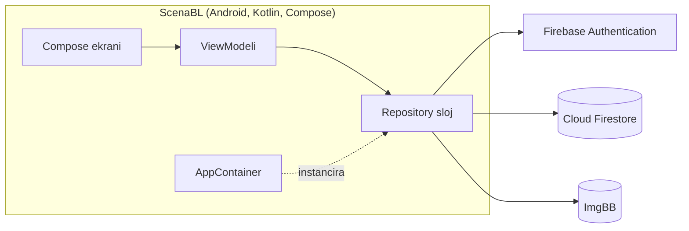
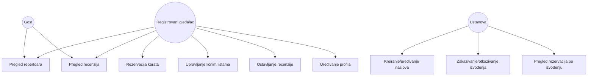

# SOFTVERSKA SPECIFIKACIJA ZAHTJEVA (SRS)

**Naziv aplikacije:** ScenaBL (Pozorišni i filmski vodič)
**Student:** Boris Petković
**Predmet:** Razvoj smartfon-aplikacija
**Verzija:** 1.0 (finalna specifikacija, usklađena sa implementacijom)

---

## 1. UVOD

### 1.1 Svrha

Ovaj dokument opisuje softverske zahtjeve za mobilnu aplikaciju ScenaBL, u obliku u kojem je aplikacija implementirana. Aplikacija korisnicima omogućava pregled kulturnih dešavanja (pozorišnih predstava i bioskopskih projekcija), rezervaciju karata, vođenje ličnih listi i ocjenjivanje odgledanog sadržaja. Ustanovama (pozorištima i bioskopima) omogućava kreiranje i upravljanje sopstvenim repertoarom.

Ciljevi aplikacije:
- Pregled aktuelnog repertoara predstava i filmova.
- Pretraga i filtriranje repertoara po više kriterijuma.
- Rezervacija karata za konkretne termine izvođenja.
- Vođenje ličnih listi ("Želim gledati", "Odgledano").
- Ocjenjivanje i recenziranje odgledanog sadržaja.
- Kreiranje i upravljanje repertoarom od strane ustanova (organizatora).

### 1.2 Opseg

Aplikacija je Android klijent (Kotlin, Jetpack Compose) koji komunicira direktno sa Firebase platformom putem zvaničnog Firebase Android SDK-a — nema posrednog REST servera. Podaci o naslovima, izvođenjima, rezervacijama, recenzijama, ličnim listama, korisnicima i ustanovama čuvaju se u **Cloud Firestore** bazi. Autentifikacija korisnika i ustanova vrši se preko **Firebase Authentication** (e-mail/lozinka). Slike (profilne slike, slike naslova) čuvaju se preko **ImgBB**, besplatnog REST servisa za hosting slika.

Aplikacija je namijenjena isključivo Android platformi i radi u onlajn režimu; posljednje učitani repertoar ostaje vidljiv i bez internet konekcije zahvaljujući ugrađenom Firestore kešu, dok operacije koje mijenjaju stanje (rezervacija, recenzija, izmjena repertoara) zahtijevaju aktivnu konekciju.

### 1.3 Definicije, skraćenice i rečnik pojmova

| Pojam | Definicija |
|---|---|
| **Korisnik / Gledalac** | Registrovani korisnik aplikacije koji rezerviše karte, vodi lične liste i ostavlja recenzije. |
| **Gost** | Neregistrovani posjetilac koji može pregledati repertoar i čitati recenzije, ali ne može rezervisati karte niti ostavljati recenzije. |
| **Ustanova / Organizator** | Nalog koji predstavlja pozorište ili bioskop; kreira naslove, zakazuje izvođenja i prati rezervacije. |
| **Naslov** | Predstava ili film koji ustanova nudi (npr. "Narodni poslanik"), nezavisno od konkretnog termina izvođenja. |
| **Izvođenje** | Konkretan termin (datum, vrijeme, sala, kapacitet, cijena) na kojem se prikazuje određeni Naslov. |
| **Rezervacija** | Proces i zapis kojim Korisnik zauzima određeni broj mjesta za konkretno Izvođenje. |
| **Recenzija** | Ocjena (1–5 zvjezdica) i tekstualni komentar koji Korisnik ostavlja za Naslov koji se nalazi u njegovoj listi "Odgledano". |
| **Lična lista** | Skup naslova koje je korisnik označio kao "Želim gledati" ili "Odgledano". |
| **Firestore Security Rules** | Skup pravila na strani Firebase-a kojima se definiše ko smije čitati/pisati koji dokument — zamjenjuje ulogu serverske autorizacione logike. |
| **UID** | Jedinstveni identifikator korisnika koji dodjeljuje Firebase Authentication; koristi se kao spona između naloga i svih podataka koje je korisnik kreirao. |
| **JSON** | Format razmjene podataka koji Firestore interno koristi za dokumente. |

---

## 2. OPŠTI OPIS

### 2.1 Perspektiva proizvoda

ScenaBL je samostalna mobilna aplikacija koja se oslanja na Firebase kao spoljni oblak-servis:

- **Klijentska aplikacija:** Android aplikacija u Kotlinu, UI izgrađen u Jetpack Compose (minSdk 26, target/compileSdk 37).
- **Autentifikacija:** Firebase Authentication (email/lozinka).
- **Baza podataka:** Cloud Firestore (NoSQL, dokument-orijentisana), sa realtime listenerima za sve prikaze repertoara, listi i recenzija.
- **Skladištenje slika:** ImgBB (REST API).
- **Arhitektura aplikacije:** MVVM (Model–View–ViewModel) sa Repository slojem i ručnim DI kontejnerom (`AppContainer`).

Pojednostavljen arhitekturni dijagram:



### 2.2 Klase korisnika i karakteristike

| Klasa korisnika | Ovlašćenja |
|---|---|
| **Gost** | Pregled repertoara, pregled detalja naslova i recenzija. Bez registracije. Read-only. |
| **Registrovani gledalac** | Sve što i Gost, plus: rezervacija karata, upravljanje ličnim listama, ostavljanje recenzija, uređivanje profila i omiljenih žanrova. |
| **Ustanova (Organizator)** | Kreira i uređuje naslove, zakazuje i otkazuje izvođenja, pregleda broj rezervacija po izvođenju. Ne rezerviše karte niti ostavlja recenzije. |

Uloga se bira jednom, prilikom prve registracije, i ne može se kasnije mijenjati kroz aplikaciju.

### 2.3 Radno okruženje

- Mobilni uređaji: Android 8.0 (API 26) i novije verzije.
- Internet konekcija: obavezna za rezervacije, recenzije, upravljanje repertoarom i učitavanje slika; pregled ranije učitanog repertoara moguć je i offline (Firestore keš).
- Backend: Firebase projekat (Cloud Firestore, Authentication) + ImgBB za slike — nema sopstvenog servera.

### 2.4 Ograničenja sistema

**Tehnička ograničenja:**
- Aplikacija radi isključivo na Android platformi (minimalno API 26).
- Firestore-ov ugrađeni offline keš prikazuje posljednje učitani repertoar bez konekcije; operacije koje pišu u bazu (rezervacija, recenzija, izmjena repertoara) zahtijevaju aktivnu konekciju, jer rezervacija koristi Firestore transakciju koja ne može biti izvršena iz keša.
- Sve slike (profilna slika, slika naslova) biraju se iz galerije uređaja i čuvaju se isključivo preko ImgBB-a (URL slike se upisuje u odgovarajući Firestore dokument).
- Firestore ne podržava strane ključeve na nivou baze — integritet referenci (npr. da `titleId` u rezervaciji zaista postoji) obezbjeđuje aplikacija (repository sloj) i Firestore Security Rules, ne baza sama.

**Poslovna pravila:**
- Korisnik može ostaviti tačno jednu recenziju po naslovu, i to samo ako se taj naslov nalazi u njegovoj listi "Odgledano"; naknadna recenzija istog naslova uređuje postojeću.
- Rezervacija se može otkazati najkasnije 2 sata prije početka izvođenja; ovo pravilo se provjerava u ViewModel sloju u trenutku korisničke akcije (nije dio Firestore Security Rules, pošto zavisi od trenutnog vremena, a ne od strukture podataka).
- Broj rezervisanih karata za jedno izvođenje ne smije prevazići kapacitet sale (`kapacitet − rezervisano ≥ broj_traženih_karata`), provjereno atomično u Firestore transakciji.
- Rezervacija predstavlja isključivo zauzimanje mjesta — aplikacija ne obrađuje plaćanje.
- Ustanova ne može zakazati izvođenje sa datumom i vremenom u prošlosti.
- Otkazivanje izvođenja od strane ustanove mijenja njegov status u "otkazano" (dokument se ne briše); postojeće rezervacije za to izvođenje ostaju zabilježene u istorijskom stanju u kojem su bile u trenutku otkazivanja.

### 2.5 Funkcionalni opseg verzije 1.0

- Registracija/prijava, gost pristup, uređivanje profila i omiljenih žanrova.
- Pregled, pretraga i filtriranje repertoara.
- Rezervacija i otkazivanje karata.
- Lične liste ("Želim gledati", "Odgledano").
- Recenzije i ocjene.
- Kreiranje/uređivanje naslova i izvođenja od strane ustanova, pregled rezervacija po izvođenju.
- Jedinstvena donja navigaciona traka, prilagođena ulozi prijavljenog korisnika.

---

## 3. FUNKCIONALNI ZAHTJEVI

Svaki zahtjev je označen jedinstvenim identifikatorom (REQ-XXX-NNN) radi lakšeg praćenja pri implementaciji i testiranju.

### 3.1 Registracija i prijava

- **REQ-AUTH-001:** Registrovani korisnik i ustanova kreiraju nalog unosom imena, e-maila i lozinke. Lozinka mora imati najmanje 8 karaktera, sadržati bar jedno veliko slovo i bar jednu cifru; ispunjenost svakog uslova prikazuje se korisniku u realnom vremenu (po jedan indikator ispod polja za lozinku, dok kuca).
- **REQ-AUTH-002:** Sistem provjerava jedinstvenost e-mail adrese pri registraciji preko Firebase Authentication-a; poruka "Ovaj e-mail je već registrovan." prikazuje se ispod forme bez ponovnog učitavanja ekrana.
- **REQ-AUTH-003:** Prijava se vrši e-mailom i lozinkom preko Firebase Authentication. Nakon prve registracije korisnik bira ulogu naloga (Gledalac ili Ustanova); uloga se upisuje u `users/{uid}.role` i ne može se kasnije mijenjati kroz aplikaciju.
- **REQ-AUTH-004:** Gost pristup (bez prijave) omogućava isključivo pregled repertoara, detalja naslova i recenzija (read-only režim) — pokušaj rezervacije, recenzije, dodavanja u lične liste ili pristupa profilu vodi na ekran za prijavu.
- **REQ-AUTH-005:** Korisnička sesija ostaje aktivna dok korisnik eksplicitno ne odjavi nalog (Firebase Authentication perzistira token lokalno); nema automatskog isteka sesije.

### 3.2 Upravljanje profilom

- **REQ-PROF-001:** Korisnik može pregledati i izmijeniti ime, prezime i profilnu sliku. Slika se bira iz galerije uređaja, uploaduje se preko ImgBB REST API-ja, a vraćeni URL se upisuje u `users/{uid}.profileImageUrl`.
- **REQ-PROF-002:** Registrovani gledalac podešava omiljene žanrove izborom iz fiksne liste (Komedija, Drama, Triler, Muzička predstava, Dokumentarni film, Akcija, Animirani film, Horor) putem višestrukog izbora (chip-ovi); izbor se čuva u `users/{uid}.favoriteGenres`.

### 3.3 Pregled i pretraga repertoara

- **REQ-BROW-001:** Početni ekran (Repertoar) prikazuje listu zakazanih izvođenja (naziv naslova, slika, ustanova, datum/vrijeme, prosječna ocjena naslova), sortiranu po datumu izvođenja (najbliže prvo), ažuriranu u realnom vremenu preko Firestore listenera.
- **REQ-BROW-002:** Detaljan prikaz naslova sadrži: sinopsis, žanr, trajanje, reditelja (ako je unesen), tip (pozorište/bioskop) i naziv ustanove, listu predstojećih izvođenja tog naslova sa preostalim brojem mjesta, prosječnu ocjenu sa brojem recenzija, i listu recenzija korisnika (najnovije prvo, sa imenom recenzenta).
- **REQ-BROW-003 — Filteri:**
  - **Dostupni filteri:** naziv (tekstualna pretraga), datum (jedan dan ili opseg), žanr (višestruki izbor), tip sadržaja (pozorište / bioskop / oba).
  - **Kontrole:** naziv — polje za pretragu sa debounce od 300ms; datum — biranje jednog dana ili opsega u jednom kalendarskom prikazu; žanr — chip-ovi za višestruki izbor iz fiksnog skupa žanrova; tip sadržaja — segmentovani prekidač sa tri opcije (Oba / Pozorište / Bioskop).
  - **Rezultat:** lista repertoara se ažurira dinamički bez ponovnog učitavanja ekrana, filteri se kombinuju logičkim I (AND); ako nema rezultata, prikazuje se poruka "Nema izvođenja koja odgovaraju filterima" sa dugmetom za resetovanje filtera.

### 3.4 Lične liste

- **REQ-LIST-001:** Korisnik dodaje naslov u listu "Želim gledati" ili "Odgledano" dodirom odgovarajućeg chip-a na detaljima naslova; stanje se mijenja odmah, bez osvježavanja ekrana.
- **REQ-LIST-002:** Obje liste su vidljive u zasebnim tabovima na ekranu "Moje liste", sa dugmetom za uklanjanje naslova iz liste.
- **REQ-LIST-003:** Naslov ne može istovremeno biti u obje liste — dodavanje u jednu listu automatski ga uklanja iz druge, ako je tamo prisutan.

### 3.5 Rezervacija karata

- **REQ-RES-001:** Korisnik unosi željeni broj karata (1–10) za odabrano izvođenje pomoću brojčanog stepper kontrolera (+/-) na ekranu za rezervaciju.
- **REQ-RES-002:** Prilikom potvrde, sistem provjerava dostupnost unutar Firestore transakcije: `kapacitet − rezervisano ≥ traženo`. Ako provjera ne prođe, prikazuje se poruka "Nema dovoljno slobodnih mjesta (dostupno: N)" i rezervacija se ne kreira.
- **REQ-RES-003:** Uspješna rezervacija se upisuje u `reservations` kolekciju sa statusom `active`, a brojač `rezervisano` na odgovarajućem izvođenju se atomično uvećava u istoj transakciji.
- **REQ-RES-004:** Korisnik može otkazati rezervaciju iz pregleda "Moje rezervacije" najkasnije 2 sata prije početka izvođenja; nakon tog roka dugme za otkazivanje je onemogućeno uz objašnjenje. Otkazivanje mijenja status u `cancelled` i atomično smanjuje `rezervisano`.

### 3.6 Recenzije i ocjene

- **REQ-REV-001:** Korisnik može ocijeniti naslov (1–5 zvjezdica, obavezno) i ostaviti tekstualni komentar (opciono, do 500 karaktera), isključivo ako se taj naslov nalazi u njegovoj listi "Odgledano"; u suprotnom je dugme za recenziju onemogućeno uz tekst "Dostupno nakon što označite naslov kao odgledan".
- **REQ-REV-002:** Sistem dozvoljava najviše jednu recenziju po korisniku po naslovu; naknadno ocjenjivanje istog naslova uređuje postojeću recenziju umjesto kreiranja nove. Korisnik može obrisati sopstvenu recenziju.
- **REQ-REV-003:** Prosječna ocjena naslova prikazana na listi i detaljima izračunava se kao aritmetička sredina svih ocjena tog naslova i osvježava se odmah nakon dodavanja, izmjene ili brisanja recenzije.

### 3.7 Upravljanje repertoarom (za ustanove)

- **REQ-ORG-001:** Ustanova kreira ili uređuje naslov unosom naziva, opisa, reditelja (opciono), trajanja, žanra, tipa (pozorište/bioskop) i slike (obavezno).
- **REQ-ORG-002:** Ustanova zakazuje izvođenje postojećeg naslova unosom datuma i vremena, sale, kapaciteta (broj > 0) i cijene karte (broj ≥ 0); datum i vrijeme moraju biti u budućnosti (provjereno na strani klijenta prije upisa).
- **REQ-ORG-003:** Ustanova na svom repertoar-ekranu pregleda listu sopstvenih naslova i, za svaki, njegova izvođenja sa brojem rezervisanih/preostalih mjesta po terminu, ažurirano u realnom vremenu preko Firestore listenera.
- **REQ-ORG-004:** Ustanova može otkazati zakazano izvođenje; time se njegov status trajno mijenja u "otkazano" (dokument se ne briše, radi očuvanja istorije rezervacija).
- **REQ-ORG-005:** Nalog ustanove je vezan za jedan zapis u `institutions` kolekciji (`ownerUid` = UID ustanove); pri prvom otvaranju repertoar-ekrana, ako zapis još ne postoji, ustanova unosi naziv i opis ustanove kroz kratku formu prije nego što može kreirati naslove.

---

## 4. ZAHTJEVI SPOLJNIH INTERFEJSA

### 4.1 Korisnički interfejsi (ekrani)

| Ekran | Namjena |
|---|---|
| **AuthScreen** | Prijava, registracija, gost pristup, izbor uloge pri prvoj registraciji. |
| **HomeScreen** | Lista aktuelnog repertoara, traka za pretragu i filtere (3.3). |
| **TitleDetailsScreen** | Detalji naslova, lista izvođenja, recenzije, dugmad za rezervaciju/lične liste/recenziju. |
| **ReservationScreen** | Unos broja karata i potvrda rezervacije za odabrano izvođenje. |
| **MyListsScreen** | Tabovi "Želim gledati" / "Odgledano". |
| **MyReservationsScreen** | Pregled i otkazivanje sopstvenih rezervacija. |
| **ProfileScreen** | Pregled/izmjena profila, omiljeni žanrovi (za gledaoce), odjava. |
| **OrganizerDashboardScreen** | (samo za ustanove) Podešavanje ustanove pri prvom otvaranju, lista sopstvenih naslova/izvođenja sa pregledom rezervacija, otkazivanje izvođenja. |
| **OrganizerTitleFormScreen** | (samo za ustanove) Forma za kreiranje/izmjenu naslova. |
| **OrganizerPerformanceFormScreen** | (samo za ustanove) Forma za zakazivanje izvođenja. |

Navigacija koristi jedan `NavHost` unutar jedne `MainActivity`. Prijavljeni korisnici imaju jedinstvenu donju navigacionu traku (NFR-USAB-002): gledaoci vide destinacije Repertoar / Moje liste / Rezervacije / Profil, a ustanove Repertoar / Moj repertoar / Profil; traka se ne prikazuje gostu niti na ekranima do kojih se dolazi dodatnom navigacijom (detalji naslova, rezervacija, forme ustanove). Gost bez prijave ulazi direktno na HomeScreen u read-only režimu.

### 4.2 Hardverski interfejsi

- Galerija uređaja — za odabir profilne slike i slike naslova.
- Internet konekcija (Wi-Fi ili mobilni podaci) — obavezna za sve operacije osim pregleda keširanog repertoara.

### 4.3 Softverski interfejsi

- **Firebase Authentication** — registracija/prijava korisnika i ustanova (email/lozinka).
- **Cloud Firestore** — čuvanje i realtime sinhronizacija svih poslovnih podataka (naslovi, izvođenja, rezervacije, recenzije, liste, korisnici, ustanove).
- **ImgBB** — čuvanje profilnih slika i slika naslova (besplatan REST servis za hosting slika).
- **Firebase Security Rules** — autorizacija pristupa na nivou dokumenta/kolekcije (zamjenjuje serversku autorizacionu logiku).

### 4.4 Komunikacioni interfejsi i format podataka

Aplikacija komunicira sa backend-om isključivo preko **Firebase Android SDK-a** (Firestore/Auth), koji interno koristi gRPC/HTTPS, i preko HTTPS REST poziva ka ImgBB-u. Podaci se razmjenjuju u **JSON** formatu — Firestore dokumenti se automatski mapiraju u/iz Kotlin data klasa (`@DocumentId`).

| Operacija | Realizacija |
|---|---|
| Prijava/registracija | `FirebaseAuth.signInWithEmailAndPassword()` / `createUserWithEmailAndPassword()` |
| Pregled repertoara | `firestore.collection("performances")` + realtime listener, spojeno sa `titles`, `institutions` i `reviews` |
| Detalji naslova i recenzije | `titles/{id}` listener + `reviews` listener filtriran po `titleId` |
| Kreiranje rezervacije | Firestore transakcija: provjera kapaciteta, upis u `reservations`, inkrement `rezervisano` na `performances/{id}` |
| Otkazivanje rezervacije | Firestore transakcija: `reservations/{id}.status = "cancelled"` + dekrement `rezervisano` |
| Recenzije | Upis/izmjena/brisanje dokumenta `reviews/{userId}_{titleId}` |
| Lične liste | Upis/brisanje dokumenta `userLists/{userId}_{titleId}` |
| Upravljanje repertoarom | Upis/izmjena dokumenata u `titles` i `performances` kolekcijama (dozvoljeno samo `role == "organizer"` preko Security Rules) |
| Upload slike | `POST` na ImgBB REST API preko Retrofit-a; vraćeni URL se čuva u odgovarajućem Firestore dokumentu |

Primjer dokumenta u kolekciji `performances`:
```json
{
  "id": "izv_105",
  "titleId": "nas_22",
  "institutionId": "ust_7",
  "datumVrijeme": "2026-09-15T20:00:00",
  "sala": "Velika sala",
  "kapacitet": 300,
  "rezervisano": 120,
  "cijena": 15.0,
  "status": "scheduled"
}
```

---

## 5. NEFUNKCIONALNI ZAHTJEVI

### 5.1 Performanse

- **NFR-PERF-001:** Lista repertoara mora se učitati (prvi prikaz sa keširanim podacima ili sa mreže) za manje od 1,5 sekundi na stabilnoj 4G vezi.
- **NFR-PERF-002:** Rezultat pretrage i filtriranja mora se osvježiti u listi za manje od 1 sekunde od posljednje promjene filtera (debounce od 300ms na tekstualnoj pretrazi).
- **NFR-PERF-003:** Upload slike (profilna slika ili slika naslova) do 5 MB mora se završiti za manje od 5 sekundi na stabilnoj 4G vezi; korisniku se prikazuje indikator napretka tokom uploada.

### 5.2 Bezbjednost

- **NFR-SEC-001 (lozinke):** Minimalna složenost lozinke — najmanje 8 karaktera, bar jedno veliko slovo, bar jedna cifra (validacija na klijentu prije slanja Firebase Authentication-u).
- **NFR-SEC-002 (sesije):** Firebase Authentication čuva sesijski token lokalno na uređaju (perzistentna prijava); token se automatski osvježava, a korisnik se odjavljuje isključivo eksplicitnom akcijom u Profilu.
- **NFR-SEC-003 (zaštita podataka):** Sav mrežni saobraćaj ka Firebase servisima i ka ImgBB API-ju ide preko TLS-a (HTTPS). Podaci u mirovanju u Cloud Firestore enkriptovani su od strane Google infrastrukture po difoltu. ImgBB je javni servis za hosting slika (vraća javno dostupan URL), pa se koristi isključivo za slike koje su i inače javno vidljive u aplikaciji (profilne slike, slike naslova).
- **NFR-SEC-004 (autorizacija):** Pristup podacima na nivou dokumenta definisan je Firestore Security Rules:
  - `users/{uid}` — javno čitanje; izmjena samo od strane vlasnika.
  - `institutions/{id}` — javno čitanje; kreiranje/izmjena samo od organizatora koji je vlasnik (`ownerUid`).
  - `titles/{id}` i `performances/{id}` — javno čitanje; kreiranje/izmjena samo od organizatora nad sopstvenom ustanovom. Izuzetak: bilo koji prijavljeni korisnik smije izmijeniti isključivo polje `rezervisano` na izvođenju, i to samo u granicama kapaciteta — ovim se omogućava transakcija rezervacije bez davanja gledaocu prava da mijenja ostale podatke izvođenja.
  - `userLists/{id}` i `reservations/{id}` — čitanje i pisanje ograničeno na vlasnika (`userId`); rezervacija se pri kreiranju mora upisati sa statusom `active` i brojem karata 1–10, a jedina dozvoljena izmjena je prelazak iz `active` u `cancelled`.
  - `reviews/{id}` — javno čitanje; kreiranje/izmjena/brisanje ograničeno na vlasnika, uz obaveznu ocjenu u rasponu 1–5.

### 5.3 Upotrebljivost

- **NFR-USAB-001:** Novi korisnik može završiti proces registracije (unos podataka + potvrda) bez dodatnog uputstva za manje od 2 minuta.
- **NFR-USAB-002:** Aplikacija koristi dosljednu, jedinstvenu donju navigacionu traku (3–4 glavne destinacije, prilagođene ulozi korisnika) i dosljedan vizuelni jezik zasnovan na Material 3 komponentama na svim ekranima.
- **NFR-USAB-003:** Vizuelni identitet aplikacije definisan je jedinstvenom "Red-Orange" bojnom šemom (Material 3 `ColorScheme`, odvojena za svijetli i tamni režim), primijenjenom dosljedno kroz sve ekrane preko centralnog `ScenaBLTheme`.

### 5.4 Pouzdanost i dostupnost

- **NFR-REL-001:** Aplikacija lokalno kešira posljednji uspješno učitan repertoar (Firestore-ov ugrađeni offline keš). Kada uređaj nema aktivnu internet konekciju, na vrhu ekrana se prikazuje vidljiva poruka ("Prikazani su posljednje učitani podaci — provjerite internet konekciju."), zasnovana na praćenju stanja mreže u realnom vremenu.
- **NFR-REL-002:** Operacije koje mijenjaju stanje (rezervacija, otkazivanje, recenzija, lične liste, upravljanje repertoarom) eksplicitno obavještavaju korisnika o uspjehu ili neuspjehu — porukom uz odgovarajuće polje ili "Snackbar" porukom na dnu ekrana — nikada tiho ne uspijevaju niti ne uspijevaju bez vidljive povratne informacije.

### 5.5 Skalabilnost i održivost

- **NFR-MAINT-001:** Aplikacija je strukturirana po MVVM arhitekturi sa jasno odvojenim slojevima (`ui/` — Compose ekrani i djeljene komponente, `viewmodel/` — po jedan ViewModel po ekranu sa `StateFlow<UiState>`, `data/repository/` i `data/remote/` — pristup Firebase-u i ImgBB-u, `di/AppContainer` — ručna injekcija zavisnosti).
- **NFR-MAINT-002:** Repository sloj je jedina tačka pristupa Firebase i ImgBB servisima; UI i ViewModel slojevi ne pozivaju spoljne SDK-ove direktno, čime se omogućava buduća zamjena backend-a bez izmjene UI koda.

---

## 6. DODACI

### 6.1 Model podataka (Cloud Firestore)

| Kolekcija | Polja | Napomena o vezama |
|---|---|---|
| `users/{uid}` | ime, prezime, email, role (`viewer`\|`organizer`), favoriteGenres[], profileImageUrl | id je Firebase Auth UID — direktna veza naloga i podataka |
| `institutions/{id}` | naziv, opis, ownerUid | `ownerUid` → `users/{uid}` sa `role == "organizer"` |
| `titles/{id}` | naziv, opis, reziser, trajanje, zanr, tip (`pozoriste`\|`bioskop`), slikaUrl, institutionId | `institutionId` → `institutions/{id}` |
| `performances/{id}` | titleId, institutionId, datumVrijeme, sala, kapacitet, rezervisano, cijena, status (`scheduled`\|`cancelled`) | `titleId` → `titles/{id}`, `institutionId` → `institutions/{id}` |
| `reservations/{id}` | userId, performanceId, brojKarata, status (`active`\|`cancelled`), datumKreiranja | `userId` → `users/{uid}`, `performanceId` → `performances/{id}` |
| `reviews/{userId}_{titleId}` | userId, titleId, ocjena, komentar, datum | Deterministički ID sprječava više od jedne recenzije po korisniku po naslovu (REQ-REV-002) |
| `userLists/{userId}_{titleId}` | userId, titleId, tipListe (`zelim_gledati`\|`odgledano`) | Deterministički ID sprječava da naslov bude u obje lične liste istovremeno (REQ-LIST-003) |

### 6.2 Dijagram slučajeva upotrebe (Use Case)



### 6.3 Rečnik pojmova

Vidi tabelu u poglavlju 1.3 — konsolidovana radi izbjegavanja duplikata.
