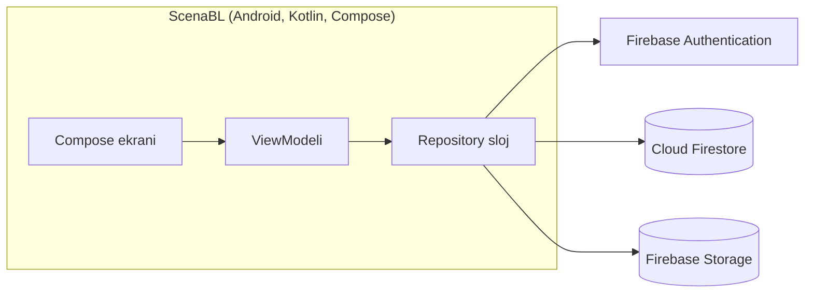
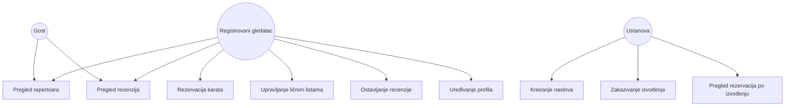

# SOFTWARE REQUIREMENTS SPECIFICATION (SRS)

**Naziv aplikacije:** ScenaBL (Pozorišni i filmski vodič)
**Student:** Boris Petković
**Predmet:** Razvoj smartfon-aplikacija
**Verzija:** 2.0 (unaprijeđena specifikacija)

## Napomena o izmjenama u odnosu na verziju 1.0

Verzija 1.0 je sadržavala neriješenu kontradikciju: zaglavlje dokumenta je navodilo "Backend: Firebase (Auth, Firestore, Storage)", dok je tekst u poglavlju 1.2 opisivao potpuno drugačiju arhitekturu — Node.js/Express REST API sa PostgreSQL bazom, uz Firebase korišćen samo za autentifikaciju. Ova verzija razrješava tu kontradikciju eksplicitnom odlukom:

> **ScenaBL koristi isključivo Firebase (Firestore, Authentication, Storage) kao backend. Ne postoji zaseban Node.js/Express server niti relaciona baza.**

Razlozi za ovu odluku:
1. Referentna aplikacija ("Caster" / Fishing App), koja se koristi kao tehnički uzor za arhitekturu i implementaciju, već koristi tačno ovaj stek (Cloud Firestore + Firebase Auth), pa se dokazani, radni obrasci mogu direktno preuzeti i unaprijediti.
2. Izgradnja i održavanje posebnog REST servera i relacione baze predstavlja značajno dodatni obim posla koji nije realan za samostalan studentski projekat u okviru jednog semestra.
3. Svi funkcionalni zahtjevi iz verzije 1.0 mogu se u potpunosti realizovati nad Firebase-om, bez gubitka funkcionalnosti.

UI sistem je takođe bio otvoreno pitanje u verziji 1.0 (`[Ovdje unesi: XML ili Jetpack Compose]`); ova verzija ga rješava odlukom da se koristi **Jetpack Compose**.

---

## 1. UVOD

### 1.1 Svrha

Ovaj dokument opisuje softverske zahtjeve za razvoj mobilne aplikacije ScenaBL. Aplikacija omogućava korisnicima praćenje kulturnih dešavanja (pozorišne predstave i bioskopske projekcije), rezervaciju karata, te ocjenjivanje i komentarisanje odgledanih sadržaja. Ustanovama (pozorištima i bioskopima) omogućava kreiranje i upravljanje sopstvenim repertoarom.

Ciljevi aplikacije:
- Pregled aktuelnog repertoara predstava i filmova.
- Pretraga i filtriranje repertoara po više kriterijuma.
- Rezervacija karata za konkretne termine izvođenja.
- Vođenje ličnih listi ("Želim gledati", "Odgledano").
- Ocjenjivanje i recenziranje odgledanog sadržaja.
- Kreiranje i upravljanje repertoarom od strane ustanova (organizatora).

### 1.2 Opseg

Aplikacija je Android klijent (Kotlin, Jetpack Compose) koji komunicira direktno sa Firebase platformom putem zvaničnog Firebase Android SDK-a — nema posrednog REST servera. Podaci o naslovima, izvođenjima, rezervacijama, recenzijama i ličnim listama čuvaju se u **Cloud Firestore** bazi. Autentifikacija korisnika i ustanova vrši se preko **Firebase Authentication**. Slike (profilne slike, slike naslova) čuvaju se u **Firebase Storage**.

Aplikacija je namijenjena isključivo Android platformi i radi u onlajn režimu uz ograničenu offline podršku (prikaz posljednjeg učitanog repertoara iz lokalnog keša).

### 1.3 Definicije, skraćenice i rečnik pojmova

| Pojam | Definicija |
|---|---|
| **Korisnik / Gledalac** | Registrovani korisnik aplikacije koji rezerviše karte, vodi lične liste i ostavlja recenzije. |
| **Gost** | Neregistrovani posjetilac koji može pregledati repertoar i čitati recenzije, ali ne može rezervisati karte niti ostavljati recenzije. |
| **Ustanova / Organizator** | Nalog koji predstavlja pozorište ili bioskop; kreira naslove, zakazuje izvođenja i prati rezervacije. |
| **Naslov** | Predstava ili film koji ustanova nudi (npr. "Narodni poslanik"), nezavisno od konkretnog termina izvođenja. |
| **Izvođenje** | Konkretan termin (datum, vrijeme, sala, kapacitet, cijena) na kojem se prikazuje određeni Naslov. |
| **Rezervacija** | Proces i zapis kojim Korisnik zauzima određeni broj mjesta za konkretno Izvođenje. |
| **Recenzija** | Ocjena (1–5 zvjezdica) i tekstualni komentar koji Korisnik ostavlja za Naslov koji se nalazi u njegovoj listi "Odgledano". |
| **Lična lista** | Skup naslova koje je korisnik označio kao "Želim gledati" ili "Odgledano". |
| **Firestore Security Rules** | Skup pravila na strani Firebase-a kojima se definiše ko smije čitati/pisati koji dokument — zamjenjuje ulogu serverske autorizacione logike. |
| **UID** | Jedinstveni identifikator korisnika koji dodjeljuje Firebase Authentication; koristi se kao spona između naloga i svih podataka koje je korisnik kreirao. |
| **JSON** | Format razmjene podataka koji Firestore interno koristi za dokumente. |
| **MVP** | Minimum Viable Product — minimalan skup funkcionalnosti dovoljan za upotrebljivu verziju 1.0 aplikacije. |

---

## 2. OPŠTI OPIS

### 2.1 Perspektiva proizvoda

ScenaBL je samostalna mobilna aplikacija koja se oslanja na Firebase kao spoljni oblak-servis:

- **Klijentska aplikacija:** Android aplikacija u Kotlinu, UI izgrađen u Jetpack Compose.
- **Autentifikacija:** Firebase Authentication (email/lozinka).
- **Baza podataka:** Cloud Firestore (NoSQL, dokument-orijentisana).
- **Skladištenje slika:** Firebase Storage.
- **Arhitektura aplikacije:** MVVM (Model–View–ViewModel) sa Repository slojem.

Pojednostavljen arhitekturni dijagram:



### 2.2 Klase korisnika i karakteristike

| Klasa korisnika | Ovlašćenja |
|---|---|
| **Gost** | Pregled repertoara, pregled detalja naslova i recenzija. Bez registracije. Read-only. |
| **Registrovani gledalac** | Sve što i Gost, plus: rezervacija karata, upravljanje ličnim listama, ostavljanje recenzija, uređivanje profila. |
| **Ustanova (Organizator)** | Kreira i uređuje naslove, zakazuje i otkazuje izvođenja, pregleda broj rezervacija po izvođenju. Ne rezerviše karte niti ostavlja recenzije. |
| **Administrator** | Van opsega verzije 1.0 — vidi poglavlje 2.5. |

### 2.3 Radno okruženje

- Mobilni uređaji: Android 8.0 (API 26) i novije verzije. *(Napomena: verzija 1.0 dokumenta je zahtijevala Android 14.0/API 36, što bi isključilo veliku većinu realnih uređaja u upotrebi; API 26 je usklađen sa preporukom profesora i sa minimalnom verzijom koju referentna Fishing App aplikacija podržava.)*
- Internet konekcija: obavezna za rezervacije, recenzije, upravljanje repertoarom i učitavanje slika; pregled ranije učitanog repertoara moguć je i offline (keš).
- Backend: Firebase projekat (Cloud Firestore, Authentication, Storage) — nema sopstvenog servera.

### 2.4 Ograničenja sistema

**Tehnička ograničenja:**
- Aplikacija radi isključivo na Android platformi (minimalno API 26).
- Offline funkcionalnost je ograničena na prikaz posljednjeg učitanog repertoara; kreiranje rezervacija, recenzija i izmjena repertoara zahtijeva aktivnu internet konekciju.
- Sve slike (profilne slike, slike naslova) čuvaju se isključivo u Firebase Storage.
- Firestore ne podržava relacione strane ključeve (foreign keys) na nivou baze — integritet referenci (npr. da `titleId` u rezervaciji zaista postoji) obezbjeđuje se na nivou aplikacije (repository sloj) i Firestore Security Rules, ne na nivou baze.

**Poslovna pravila:**
- Korisnik može ostaviti tačno jednu recenziju po naslovu, i to samo ako se taj naslov nalazi u njegovoj listi "Odgledano".
- Rezervacija se može otkazati najkasnije 2 sata prije početka izvođenja.
- Broj rezervisanih karata za jedno izvođenje ne smije prevazići kapacitet sale (`kapacitet − rezervisano ≥ broj_traženih_karata`).
- Recenzija sadrži komentar dužine do 500 karaktera i ocjenu u rasponu 1–5.
- Ustanova ne može zakazati izvođenje sa datumom u prošlosti.

### 2.5 Opseg verzije 1.0 (MVP)

**U opsegu:**
- Registracija/prijava, gost pristup, uređivanje profila.
- Pregled, pretraga i filtriranje repertoara.
- Rezervacija i otkazivanje karata.
- Lične liste ("Želim gledati", "Odgledano").
- Recenzije i ocjene.
- Kreiranje/uređivanje naslova i izvođenja od strane ustanova, pregled rezervacija.

**Van opsega verzije 1.0** *(eksplicitno izostavljeno radi realnog obima studentskog projekta, u skladu sa preporukom da je bolje potpuno specifikovati manji MVP nego nejasno nabrojati funkcije koje se neće implementirati)*:
- Uloga Administratora i pripadajući ekran za moderaciju — u v1.0 se moderacija (brisanje neprikladnih recenzija, blokiranje naloga ustanova) obavlja ručno kroz Firebase konzolu, van same aplikacije.
- Push notifikacije (FCM) — nisu dio v1.0; navedene kao mogućnost za buduće verzije.
- Plaćanje karata unutar aplikacije (rezervacija ne uključuje realnu naplatu, samo zauzimanje mjesta).
- Web administratorski panel.
- Offline kreiranje rezervacija/recenzija sa naknadnom sinhronizacijom.

---

## 3. FUNKCIONALNI ZAHTJEVI

Svaki zahtjev je označen jedinstvenim identifikatorom (REQ-XXX-NNN), po uzoru na konvenciju iz `FishingApp.md`, radi lakšeg praćenja pri implementaciji i testiranju.

### 3.1 Registracija i prijava

- **REQ-AUTH-001:** Registrovani korisnik i ustanova kreiraju nalog unosom imena, e-maila i lozinke. Lozinka mora imati najmanje 8 karaktera, sadržati bar jedno veliko slovo i bar jednu cifru; validacija se prikazuje korisniku u realnom vremenu dok kuca (indikatori ispod polja za lozinku).
- **REQ-AUTH-002:** Sistem provjerava jedinstvenost e-mail adrese pri registraciji (Firebase Authentication vraća grešku `email-already-in-use`); poruka o grešci se prikazuje ispod polja za e-mail bez ponovnog učitavanja ekrana.
- **REQ-AUTH-003:** Prijava se vrši e-mailom i lozinkom preko Firebase Authentication. Nakon prve registracije korisnik bira ulogu naloga: Gledalac ili Ustanova; uloga se upisuje u `users/{uid}.role` i ne može se kasnije mijenjati kroz aplikaciju.
- **REQ-AUTH-004:** Gost pristup (bez prijave) omogućava isključivo pregled repertoara, detalja naslova i recenzija (read-only režim) — dugmad za rezervaciju, recenziju i liste su onemogućena i prikazuju poziv na prijavu.
- **REQ-AUTH-005:** Korisnička sesija ostaje aktivna dok korisnik eksplicitno ne odjavi nalog (Firebase Authentication perzistira token lokalno); nema automatskog isteka sesije u v1.0 (vidi napomenu u 5.2 o razlici u odnosu na server-sesijski model).

### 3.2 Upravljanje profilom

- **REQ-PROF-001:** Korisnik može pregledati i izmijeniti ime, prezime i profilnu sliku. Slika se bira iz galerije ili kamere, uploaduje se u Firebase Storage (`profile_images/{uid}.jpg`), a URL se upisuje u `users/{uid}.profileImageUrl`.
- **REQ-PROF-002:** Korisnik podešava omiljene žanrove izborom iz fiksne liste (Komedija, Drama, Triler, Muzička predstava, Dokumentarni film, Akcija, Animirani film, Horor) putem višestrukog izbora (chip-ovi koji se mogu selektovati/deselektovati); izbor se čuva u `users/{uid}.favoriteGenres` kao lista.

### 3.3 Pregled i pretraga repertoara

- **REQ-BROW-001:** Početni ekran prikazuje listu aktuelnih izvođenja (naziv naslova, slika, ustanova, datum/vrijeme, prosječna ocjena), sortiranu po datumu izvođenja (najbliže prvo).
- **REQ-BROW-002:** Detaljan prikaz naslova sadrži: sinopsis, žanr, trajanje, reditelja/tip (pozorište/bioskop), listu predstojećih izvođenja tog naslova sa preostalim brojem mjesta, prosječnu ocjenu i listu recenzija korisnika (sortirano od najnovije).
- **REQ-BROW-003 — Filteri (specificirano po uzoru na profesorovu preporuku o preciznosti):**
  - **Dostupni filteri:** naziv (tekstualna pretraga), datum (jedan dan ili opseg), žanr (višestruki izbor), tip sadržaja (pozorište / bioskop / oba).
  - **Kontrole:** naziv — polje za pretragu sa debounce od 300ms; datum — `DatePicker` (podržava izbor jednog dana ili opsega); žanr — lista čekboksova/chip-ova učitana iz fiksnog skupa žanrova; tip sadržaja — segmentovani prekidač (toggle) sa tri opcije.
  - **Rezultat:** lista repertoara se ažurira dinamički bez ponovnog učitavanja ekrana, filteri se kombinuju logičkim I (AND); ako nema rezultata, prikazuje se poruka "Nema izvođenja koja odgovaraju filterima" sa dugmetom za resetovanje filtera.

### 3.4 Sačuvani sadržaji i lične liste

- **REQ-LIST-001:** Korisnik može dodati naslov u listu "Želim gledati" ili "Odgledano" jednim dodirom na dugme sa ikonicom na detaljima naslova; dugme mijenja stanje (npr. ispunjena/prazna ikonica) bez potrebe za osvježavanjem ekrana.
- **REQ-LIST-002:** Obje liste su vidljive u zasebnim tabovima unutar ekrana profila, sa mogućnošću uklanjanja naslova iz liste (swipe-to-delete ili dugme za brisanje).
- **REQ-LIST-003:** Naslov ne može istovremeno biti u obje liste — dodavanje u "Odgledano" automatski ga uklanja iz "Želim gledati", ako je tamo prisutan.

### 3.5 Rezervacija karata

- **REQ-RES-001:** Korisnik unosi željeni broj karata (1–10) za odabrano izvođenje pomoću brojčanog stepper kontrolera (+/-).
- **REQ-RES-002:** Prilikom potvrde, sistem provjerava dostupnost: `kapacitet − rezervisano ≥ traženo`. Ako provjera ne prođe, prikazuje se poruka "Nema dovoljno slobodnih mjesta (dostupno: N)" i rezervacija se ne kreira.
- **REQ-RES-003:** Uspješna rezervacija se upisuje u `reservations` kolekciju sa statusom `active`, a brojač `reservedCount` na odgovarajućem izvođenju se atomično uvećava (Firestore transakcija) kako bi se izbjeglo dupliranje mjesta pri istovremenim rezervacijama.
- **REQ-RES-004:** Korisnik može otkazati rezervaciju iz pregleda "Moje rezervacije" najkasnije 2 sata prije početka izvođenja; nakon tog roka dugme za otkazivanje je onemogućeno uz objašnjenje. Otkazivanje mijenja status u `cancelled` i smanjuje `reservedCount`.

### 3.6 Recenzije i ocjene

- **REQ-REV-001:** Korisnik može ocijeniti naslov (1–5 zvjezdica, obavezno) i ostaviti tekstualni komentar (opciono, do 500 karaktera), isključivo ako se taj naslov nalazi u njegovoj listi "Odgledano"; u suprotnom je dugme "Ostavi recenziju" onemogućeno uz tekst "Dostupno nakon što označite naslov kao odgledan".
- **REQ-REV-002:** Sistem dozvoljava najviše jednu recenziju po korisniku po naslovu; naknadno ocjenjivanje istog naslova uređuje postojeću recenziju umjesto kreiranja nove.
- **REQ-REV-003:** Prosječna ocjena naslova prikazana na listi i detaljima izračunava se kao aritmetička sredina svih ocjena tog naslova i osvježava se odmah nakon dodavanja/izmjene recenzije.

### 3.7 Upravljanje repertoarom (za ustanove)

- **REQ-ORG-001:** Ustanova kreira novi naslov unosom naziva, opisa, žanra, tipa (pozorište/bioskop), trajanja i slike (obavezno).
- **REQ-ORG-002:** Ustanova dodaje konkretno izvođenje postojećeg naslova unosom datuma i vremena (`DatePicker` + `TimePicker`), sale, kapaciteta (broj > 0) i cijene karte (broj ≥ 0); datum mora biti u budućnosti (validacija na strani klijenta prije upisa).
- **REQ-ORG-003:** Ustanova pregleda listu svojih izvođenja sa brojem rezervisanih/preostalih mjesta po terminu, ažurirano u realnom vremenu (Firestore listener).
- **REQ-ORG-004:** Ustanova može otkazati zakazano izvođenje; svi korisnici sa aktivnim rezervacijama za to izvođenje se vide u listi za obavještavanje (ručno, van v1.0 push notifikacija — vidi 2.5).

---

## 4. ZAHTJEVI SPOLJNIH INTERFEJSA

### 4.1 Korisnički interfejsi (ekrani)

| Ekran | Namjena |
|---|---|
| **AuthScreen** | Prijava, registracija, gost pristup, izbor uloge pri prvoj registraciji. |
| **HomeScreen** | Lista aktuelnog repertoara, traka za pretragu i filtere (3.3). |
| **TitleDetailsScreen** | Detalji naslova, lista izvođenja, recenzije, dugme za rezervaciju/dodavanje u liste. |
| **ReservationScreen** | Unos broja karata i potvrda rezervacije za odabrano izvođenje. |
| **MyListsScreen** | Tabovi "Želim gledati" / "Odgledano". |
| **MyReservationsScreen** | Pregled i otkazivanje sopstvenih rezervacija. |
| **ProfileScreen** | Pregled/izmjena profila, omiljeni žanrovi, odjava. |
| **OrganizerDashboardScreen** | (samo za ustanove) Lista sopstvenih naslova/izvođenja, kreiranje novih. |
| **OrganizerTitleFormScreen / OrganizerPerformanceFormScreen** | (samo za ustanove) Forme za kreiranje/izmjenu naslova i izvođenja. |

### 4.2 Hardverski interfejsi

- Kamera i/ili galerija uređaja — za odabir profilne slike i slike naslova.
- Internet konekcija (Wi-Fi ili mobilni podaci) — obavezna za sve operacije osim pregleda keširanog repertoara.

### 4.3 Softverski interfejsi

- **Firebase Authentication** — registracija/prijava korisnika i ustanova (email/lozinka).
- **Cloud Firestore** — čuvanje i sinhronizacija svih poslovnih podataka (naslovi, izvođenja, rezervacije, recenzije, liste, profili).
- **Firebase Storage** — čuvanje profilnih slika i slika naslova.
- **Firebase Security Rules** — autorizacija pristupa na nivou dokumenta/kolekcije (zamjenjuje serversku autorizacionu logiku iz v1.0 dokumenta).

### 4.4 Komunikacioni interfejsi i format podataka

Za razliku od verzije 1.0, koja je opisivala REST endpoint-e ka sopstvenom serveru, ScenaBL komunicira sa backend-om isključivo preko **Firebase Android SDK-a**, koji interno koristi gRPC/HTTPS ka Firebase servisima. Umjesto REST endpoint tabele, u nastavku su navedene operacije nad Firestore kolekcijama koje funkcionalno odgovaraju originalno planiranim endpoint-ima:

| Operacija (ekvivalent REST endpoint-a iz v1.0) | Firestore operacija |
|---|---|
| `POST /login` | `FirebaseAuth.signInWithEmailAndPassword()` |
| `GET /repertoar` | `firestore.collection("performances")` + realtime listener |
| `GET /naslov/{id}` | `firestore.collection("titles").document(id)` + `collection("reviews").whereEqualTo("titleId", id)` |
| `POST /rezervacija` | Firestore transakcija: upis u `reservations` + inkrement `reservedCount` na `performances/{id}` |
| `PATCH /rezervacija/{id}/otkazi` | Ažuriranje `reservations/{id}.status = "cancelled"` + dekrement `reservedCount` |
| `POST /recenzije` | Upis/izmjena dokumenta u `reviews` kolekciji |
| `POST /liste` | Upis/izmjena dokumenta u `userLists` kolekciji |
| `POST /izvodjenje` | Upis dokumenta u `performances` kolekciji (dozvoljeno samo `role == "organizer"` preko Security Rules) |

Podaci se, kao i u v1.0, razmjenjuju u **JSON** formatu — Firestore dokumenti se serijalizuju/deserijalizuju u Kotlin data klase preko Firestore-ovog automatskog mapiranja (`@DocumentId`, `@PropertyName`), na isti način na koji referentna Fishing App aplikacija mapira `MapPin` (vidi Implementation Guide, poglavlje 5).

Primjer dokumenta u kolekciji `performances`:
```json
{
  "id": "izv_105",
  "titleId": "nas_22",
  "institutionId": "ust_7",
  "datum_vrijeme": "2026-09-15T20:00:00",
  "sala": "Velika sala",
  "kapacitet": 300,
  "rezervisano": 120,
  "cijena": 15.0
}
```

---

## 5. NEFUNKCIONALNI ZAHTJEVI

### 5.1 Performanse

- **NFR-PERF-001:** Lista repertoara mora se učitati (prvi prikaz sa keširanim podacima ili sa mreže) za manje od 1,5 sekundi na stabilnoj 4G vezi.
- **NFR-PERF-002:** Rezultat pretrage i filtriranja mora se osvježiti u listi za manje od 1 sekunde od posljednje promjene filtera.
- **NFR-PERF-003:** Upload slike (profilna slika ili slika naslova) do 5 MB mora se završiti za manje od 5 sekundi na stabilnoj 4G vezi; korisniku se prikazuje indikator napretka.

### 5.2 Bezbjednost

- **NFR-SEC-001 (lozinke):** Minimalna složenost lozinke — najmanje 8 karaktera, bar jedno veliko slovo, bar jedna cifra (validacija na klijentu prije slanja Firebase Authentication-u).
- **NFR-SEC-002 (sesije):** Firebase Authentication čuva sesijski token lokalno na uređaju (perzistentna prijava); u odnosu na model sa v1.0 dokumenta ovo je namjerno drugačije od klasičnog "isteka sesije nakon 30 minuta" jer Firebase Auth SDK ne podržava server-side timeout sesije na ovaj način — umjesto toga, token se automatski osvježava, a korisnik se odjavljuje isključivo eksplicitnom akcijom. Ova razlika u odnosu na profesorov primjer se ovdje eksplicitno navodi kao svjesna arhitekturna odluka, a ne propust.
- **NFR-SEC-003 (zaštita podataka):** Sav mrežni saobraćaj ka Firebase servisima ide isključivo preko TLS-a (obezbjeđeno od strane Firebase SDK-a, nije konfigurabilno niti isključivo). Podaci u mirovanju (at rest) u Cloud Firestore i Firebase Storage su enkriptovani od strane Google infrastrukture po difoltu (AES-256).
- **NFR-SEC-004 (autorizacija):** Pristup podacima na nivou dokumenta definisan je Firestore Security Rules: korisnik može mijenjati isključivo svoj `users/{uid}` dokument i dokumente u `reservations`/`reviews`/`userLists` čiji `userId` odgovara njegovom UID-u; upis u `titles`/`performances` dozvoljen je samo nalozima sa `role == "organizer"` i to samo za dokumente sa odgovarajućim `institutionId`.

### 5.3 Upotrebljivost

- **NFR-USAB-001:** Novi korisnik mora moći da završi proces registracije (unos podataka + potvrda) bez dodatnog uputstva za manje od 2 minuta.
- **NFR-USAB-002:** Aplikacija koristi dosljednu navigaciju (donja navigaciona traka sa 3–4 glavne destinacije) i dosljedan vizuelni jezik (Material 3 komponente) na svim ekranima.
- **NFR-USAB-003:** UI dizajn prati wireframe/mockup pripremljen prije implementacije (vidi Implementation Guide, poglavlje 4, za preporuku alata); ovim se ispunjava profesorova preporuka da se upotrebljivost referiše na konkretan UI/UX nacrt.

### 5.4 Pouzdanost i dostupnost

- **NFR-REL-001:** Aplikacija lokalno kešira posljednji uspješno učitan repertoar (Firestore-ov ugrađeni offline cache) i prikazuje ga uz vidljivu poruku ("Prikazani su posljednje učitani podaci — provjerite internet konekciju") ukoliko je mrežna veza privremeno nedostupna.
- **NFR-REL-002:** Operacije koje mijenjaju stanje (rezervacija, otkazivanje, recenzija) moraju eksplicitno obavijestiti korisnika o uspjehu ili neuspjehu (nikada tiho ne uspjeti) — ovim se ispravlja uočeni propust u referentnoj Fishing App aplikaciji, gdje pojedine operacije nemaju korisnički vidljivu povratnu informaciju o grešci.

### 5.5 Skalabilnost i održivost

- **NFR-MAINT-001:** Aplikacija je strukturirana po MVVM arhitekturi sa jasno odvojenim slojevima (UI/Compose, ViewModel, Repository, Data), čime se olakšava testiranje i dalje proširivanje (vidi Implementation Guide, poglavlje 2).
- **NFR-MAINT-002:** Repository sloj je jedina tačka pristupa Firebase servisima; UI i ViewModel slojevi ne pozivaju Firebase SDK direktno, čime se omogućava buduća zamjena backend-a bez izmjene UI koda.

---

## 6. DODACI

### 6.1 Model podataka (Cloud Firestore)

Firestore je NoSQL, dokument-orijentisana baza — nema stranih ključeva na nivou baze. Veze između kolekcija realizuju se preko ID referenci koje aplikacija i Security Rules tumače kao veze (funkcionalni ekvivalent stranog ključa iz relacionog modela iz v1.0 dokumenta).

| Kolekcija | Polja | Napomena o vezama |
|---|---|---|
| `users/{uid}` | id (=uid), ime, prezime, email, role (`viewer`\|`organizer`), favoriteGenres[], profileImageUrl | id je Firebase Auth UID — direktna veza naloga i podataka (ispravka propusta iz referentne Fishing App aplikacije, gdje `createdBy` nije bio povezan sa stvarnim UID-om) |
| `institutions/{id}` | naziv, opis, ownerUid | `ownerUid` → `users/{uid}` sa `role == "organizer"` |
| `titles/{id}` | naziv, opis, reziser, trajanje, zanr, tip (`pozoriste`\|`bioskop`), slikaUrl, institutionId | `institutionId` → `institutions/{id}` |
| `performances/{id}` | titleId, institutionId, datumVrijeme, sala, kapacitet, rezervisano, cijena | `titleId` → `titles/{id}`, `institutionId` → `institutions/{id}` |
| `reservations/{id}` | userId, performanceId, brojKarata, status (`active`\|`cancelled`), datumKreiranja | `userId` → `users/{uid}`, `performanceId` → `performances/{id}` |
| `reviews/{id}` | userId, titleId, ocjena, komentar, datum | `userId` → `users/{uid}`, `titleId` → `titles/{id}` |
| `userLists/{id}` | userId, titleId, tipListe (`zelim_gledati`\|`odgledano`) | `userId` → `users/{uid}`, `titleId` → `titles/{id}` |

### 6.2 Dijagram slučajeva upotrebe (Use Case)



### 6.3 Rečnik pojmova

Vidi tabelu u poglavlju 1.3 — konsolidovana radi izbjegavanja duplikata.
